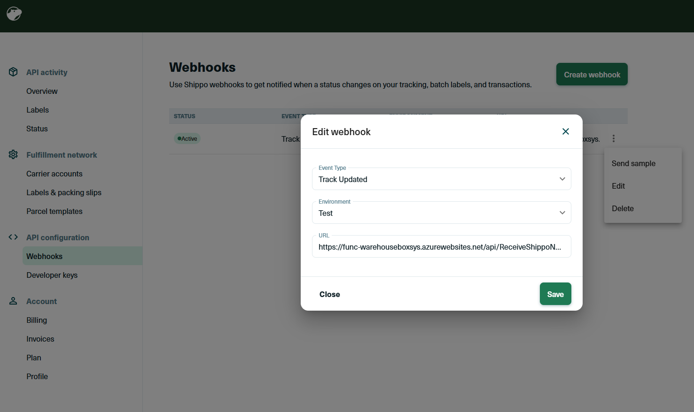

## Warehouse BoxSys  Shippo Integration System - Azure Functions in  C#.NET

This project is a Azure Functions project that integrates with Shippo Webhooks to get the Notifications 
for Box Tracking status for a shipment,a nd update the status into WarehouseBoxsys with API. 
The project is a part of the Warehouse BoxSys project.

# Shippo Webhook Setup
- Create a Shippo account and get the API key.
- deploy the Azure function App 'func-WarehouseBoxSys' to the appropriate resource group.
- get the url of the 'ReceiveShippoNotifications' function and update the Shippo webhook url with the function url.
-  
- 
# On Premise Integration to WarehouseBoxsys API thru Hybrid Connection
- Create a Hybrid Connection in Azure and add the connection string to the Azure function App settings.
- Development connection from the on-premise server.
    - Hybrid connection Name :hc-warehouseboxsys-dev
    - Endpoint Host : bbgappdev01
    - Endpoint Port : 8887
    - Service Bus Namespace : sbns-warehouseboxsys
    - Namespace Location : southcentralus
    - Hybrid connection managers : 1 connected
    - Gateway Connection String : Endpoint=sb://sbns-warehouseboxsys.servicebus.windows.net/;SharedAccessKeyName=defaultListener;SharedAccessKey=Xb2wIi8gi4Gi0d6zS4e2MQs/tVa6xJc1t+ARmNmcs3k=;EntityPath=hc-warehouseboxsys-dev
- Validation Env connection from the on-premise server.
    - Hybrid connection Name :hc-warehouseboxsys-val
    - Endpoint Host : bbgappval01
    - Endpoint Port : 8887
    - Service Bus Namespace : sbns-warehouseboxsys
    - Namespace Location : southcentralus
    - Hybrid connection managers : 1 connected
    - Gateway Connection String : Endpoint=sb://sbns-warehouseboxsys.servicebus.windows.net/;SharedAccessKeyName=defaultListener;SharedAccessKey=/ShiV6wUN335FwkYdjhPSUTz69fHXWREO+ARmAS2UiA=;EntityPath=hc-warehouseboxsys-val
- Update Hybrid Connection Manager on the on-premise server with the connection string.

# Testing Shippo notifications with Postman collection
- Import the Postman collection 'WarehouseBoxSys.postman_collection.json' to Postman
- update the url for the post request in the collection to the 'ReceiveShippoNotifications' function url.
- update the collection variable values with the appropriate values.
- tracking_number
- ReceiveShippo_FunctionKey
- currentDateUtc (should default to current date with script pm.collectionVariables.set("currentDateUtc", currentDate);)
- 
    
## How it works
Here are the main functions in the project:
- ReceiveShippoNotifications
    - Receives the notifications from Shippo webhooks and stores them in a 'shipponotifications' queue. 
- UpdateShippTrackingStatus
    - Processs the notifications from the 'shipponotifications' queue and updates the tracking status of the shipment in the database.
- RetryNotificationsInFailedQueue
    - this function is triggered by Queue retries the notifications in the 'failednotifications' queue. By defaut this function will be in Disabled state.
    - Review the logs and resolve the issue before  enable this function to retry the failed notifications.
    - once retry is successful disable this function again
- RetryNotificationsInPoisonQueue
    - this function is triggered by Queue retries the notifications in the 'shipponotification-poison' queue. By defaut this function will be in Disabled state.
    - Review the logs and resolve the issue before  enable this function to retry the failed notifications.
    - once retry is successful disable this function again
-  

## Learn more

<TODO> Documentation
- Azure functions : https://learn.microsoft.com/en-us/azure/azure-functions/
- Shippo API : https://goshippo.com/docs/reference
- Reaching into your On-Prem services using Azure Hybrid Connections https://azuregems.io/azure-hybrid-connections/
- Azure Landing Zones: https://www.youtube.com/watch?v=mluS8ovuBKg
- Authentication to Azure Services : https://learn.microsoft.com/en-us/dotnet/azure/sdk/authentication/local-development-service-principal?tabs=azure-portal%2Cwindows%2Ccommand-line
- Automated deployments of Azure Resources : https://azure.github.io/awesome-azd/
- 

